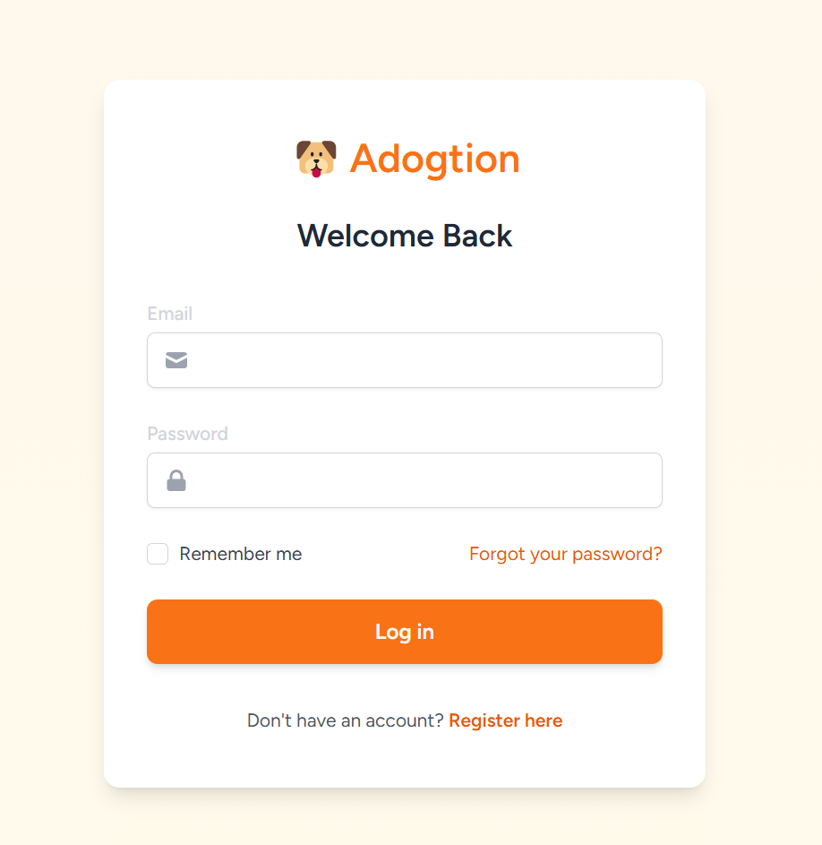

## Dog Adoption Page (Adogtion)

•	Author: Harris Teh, Cheryl Kong <br>

## Requirements
•	PHP 7.3 or higher <br>
•	Node 12.13.0 or higher <br>

## Usage <br>
Setting up your development environment on your local machine: <br>
```
git clone https://github.com/cheryl7114/dog-adoption-page.git
cd dog-adoption-page
cp .env.example .env
composer install
php artisan key:generate
php artisan cache:clear && php artisan config:clear
php artisan serve
```

## Before starting <br>
Create a database <br>
```
mysql
create database laravelblog;
exit;
```

Setup your database credentials in the .env file <br>
```
DB_CONNECTION=mysql
DB_HOST=127.0.0.1
DB_PORT=3306
DB_DATABASE=adogtion
DB_USERNAME={USERNAME}
DB_PASSWORD={PASSWORD}
```

Migrate the tables
```
php artisan migrate
```

Migrate the seeders (get the test data)
```
php artisan migrate:fresh --seed
```
## PayPal Donation Testing

To test the donation functionality with PayPal, you'll need to set up a sandbox environment:

1. **Create a PayPal Developer Account**:
   - Go to [developer.paypal.com](https://developer.paypal.com) and sign up/login
   - Access the Developer Dashboard

2. **Create Sandbox Test Accounts**:
   - Go to "Accounts" in the Sandbox section
   - Create both a Business account (to receive payments) and a Personal account (to make test payments)

3. **Create a Sandbox App**:
   - Go to "Apps & Credentials"
   - Create a new REST API app
   - Copy the Sandbox Client ID

4. **Add to your .env file**:
```
PAYPAL_CLIENT_ID="${PAYPAL_CLIENT_ID}"
PAYPAL_BUSINESS_EMAIL="${PAYPAL_BUSINESS_EMAIL}"
```

## Image Setup

The application requires dog images to function properly. Images are stored in the `storage/app/public/images/dogs` directory.

1. **Create symbolic link for storage**:
```
php artisan storage:link
```
This creates a symbolic link from `public/storage` to `storage/app/public`

2. **Image placement**:
- Place dog profile images in `storage/app/public/images/dogs/`
- Ensure the `happy-dog.jpg` exists for the donation thank-you modal
- The seeder expects images named according to the dog's name (e.g. luna.jpg)

## Features
Filter a list of adoptable dogs by breed, size, or age


User registration/login



Ability for users to express interest or apply for adoption


Admin panel to add/edit/delete dogs


Admin panel to approve/reject adoption requests


Admin panel to search through users and admins


Donations (using PayPal)

